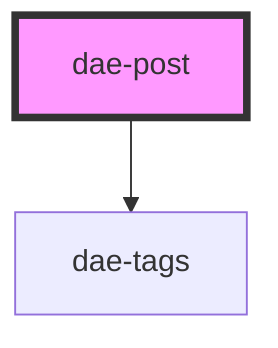

# my-component

<!-- Auto Generated Below -->

## Properties

| Property      | Attribute     | Description | Type     | Default     |
| ------------- | ------------- | ----------- | -------- | ----------- |
| `article`     | `article`     |             | `string` | `undefined` |
| `date`        | `date`        |             | `string` | `undefined` |
| `description` | `description` |             | `string` | `undefined` |
| `image`       | `image`       |             | `string` | `undefined` |
| `tags`        | `tags`        |             | `string` | `undefined` |

## Dependencies

### Depends on

- [dae-tags](../tags)

### Graph

----------------------------------------------

*Built with [StencilJS](https://stenciljs.com/)*
